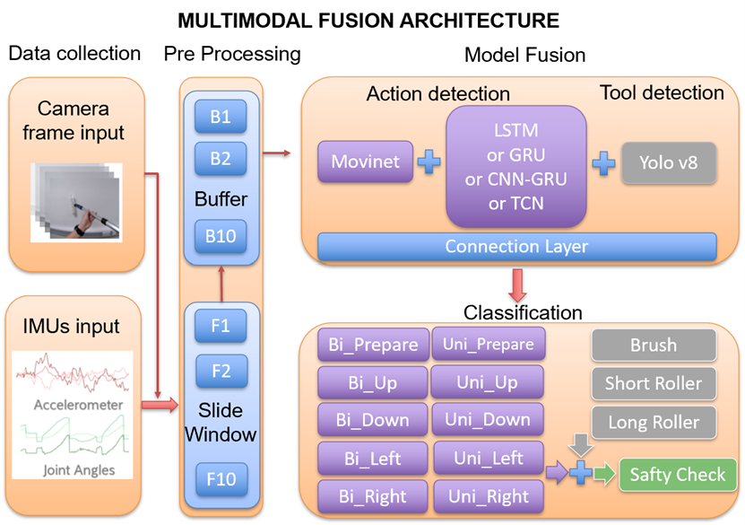

# Upper Limb Exoskeleton Real-Time Detection

This project provide four **real-time human intention recognition system** for an upper limb exoskeleton, which were compared to get the most accurate system for real-time detection of user intent during painting tasks, including the tool being used and the current task phase. 

It uses pre-trained models:
- **YOLO** model for detecting painting tools and hands.
  
To recognize user actions based on both video frames and IMU data, it combines MoViNet with one of the four deep learning models:

- **Long Short-Term Memory** (LSTM)
- **Gated Recurrent Units** (GRU)
- **Convolutional Neural Network–Gated Recurrent Unit** (CNN-GRU)
- **Temporal Convolutional Network** (TCN)



YOLO and MoViNet models are trained on a custom **Paint Database** (link :).  

The system outputs:

- **Action label**: one of 10 classes (e.g.,`Bimanual_Up`,`Bimanual_Right`, `Unimanual_Down`, `Unimanual_Prepare`).
- **Detected tool**: Brush, Short roller, or Long roller.

## How to Run Real-Time Detection

1. Place the following pre-trained models in the `Pre Trained Model/` folder:
   - YOLO model (`best.pt`)
   - Fusion model using:
         - LSTM: `fusion_movinet_lstm_final.pt`
         - GRU: `fusion_movinet_gru_final.pt`
         - CNN-GRU: `fusion_movinet_cnn_gru_final_2.pt`
         - TCN: `fusion_movinet_tcn_final_9.pt`
     
3. Start the real-time prediction script:

For LSTM: 
```bash
python LSTM_Real_Time.py
```
For GRU: 
```bash
python GRU_Real_Time.py
```
For CNN-GRU:
```bash
python CNN_GRU_Real_Time.py
```
For TCN: 
```bash
python TCN_Real_Time.py
```

3. In another terminal, start collecting IMU and camera data:

```bash
python safe_imu_data_collection.py
```

The system will read IMU and video data in real time and output the detected action and tool.


